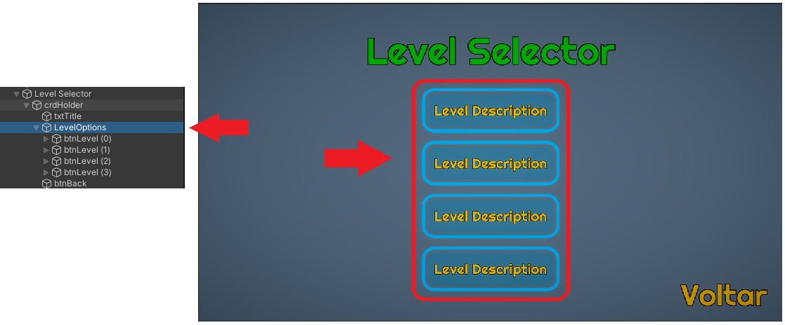
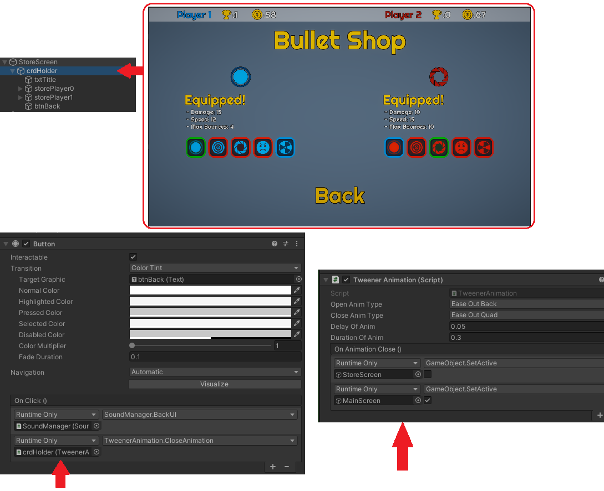

# Unity_LeanTween_AnimationScripts
Some of usefull scripts to add in your UI's for nice animations!

Make your UI pop with easy to implement animations!

LeanTween was developed by <a href='https://assetstore.unity.com/publishers/1487'>Dented Pixel</a>, show hiw some love on the Asset Store :D!

/LeanTween (Folder): Contains the base framework for lean tween! You can also get it for free from the Unity Asset Store <a href='https://assetstore.unity.com/packages/tools/animation/leantween-3595'>HERE</a>!  
/Leantween Scripts (Folder): Contains the 3 scripts to use in your UI, or other areas that you may find it useful in your project :D  

# How it can look!

## LeanTweanerListAnimator.cs
- Attach to a parent of a list, it will animate each one of the childs in order (from top to bottom)!

### Example:  

- Attaching the ListAnimator on "LevelOptions" will animate them in order!
- You can set how long the delay to start animating the childs, delay between childs animation and the duration of the animation!

## TweenerAnimation.cs
- Attach to an object such as a card that holds some info (MeesageBoxes or entire screens), you can also set UnityEvents  

### Example:  

- Set type of open and close animation!
- Set values to your liking!
- To activate close animation reference the TweenerAnimation in your card in a button or script.
- Set to deactivate whatever you want on the close event

## LeanTweanerPopUp.cs
- Similar to TweenerAnimation, will Open the desired card (Good for notification Pop Ups or DamageTexts) and close after a desired time!
- Set values to your liking and done, the pop up will autodeactivate after close animation!